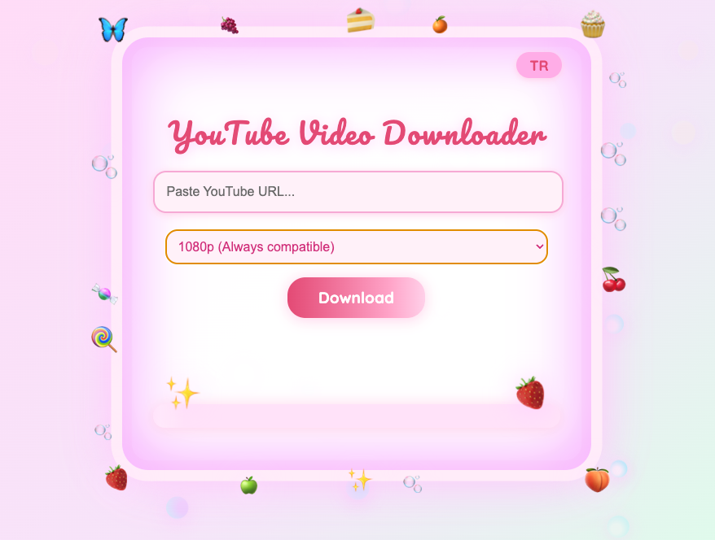

# 🍓✨ Fairycore YouTube Video Downloader ✨🦋

Welcome to your magical pastel fairyland!  
This is not just a YouTube downloader — it's an aesthetic experience for cozy, dreamy souls who love sparkles, pastel vibes, and pure happiness.  
Transform your downloads into a magical ritual, complete with emoji rain, confetti bursts, cute popups, and a bubbly, berry-filled fairycore interface.  
No accounts, no ads, no stress: just you, your favorite videos, and endless sparkly joy! 🍰🌈

---



---

## 🌷💖 Features

- **Enchanting Fairycore UI:**  
  Animated pastel windows, floating bubbles, sparkly borders, and magical emoji details everywhere. Every download feels like a celebration! 🪄🧚
- **Language Magic:**  
  Switch instantly between 🦋 English & 🌸 Turkish (TR/EN toggle) — pastel inclusivity for everyone!
- **Real Download Progress:**  
  Watch your download come to life with a real-time progress bar — accurate and satisfying, never boring!
- **Animated Surprises:**  
  Enjoy confetti, emoji rain, and animated kawaii popups when your downloads complete. Cake, berries, sparkles — pure serotonin! 🍓✨🎉
- **Fairycore Interactivity:**  
  Tap the twinkling star, find floating berries, or just enjoy the cute bubble border. Downloading has never been this magical or fun!
- **Cross-Platform Magic:**  
  Works on **Windows, MacOS, and Linux** (AppImage). Share the joy with everyone — all you need is a pastel heart!
- **Privacy-First:**  
  No signups, no tracking, no hidden surprises. Everything happens on your computer, just for you.
- **Super Easy Setup:**  
  Simple, friendly instructions — even your non-techie friends will find it a breeze!

---

## 🪄✨ Setup & Installation

1. **Clone the project:**
    ```sh
    git clone https://github.com/CeydaSerttas/Youtube-Video-Downloader-Fairycore-Kawaii-Edition-.git
    cd Youtube-Video-Downloader-Fairycore-Kawaii-Edition-
    ```

2. **Download required binaries:**
    - [yt-dlp (Mac/Linux)](https://github.com/yt-dlp/yt-dlp/releases/latest/download/yt-dlp)
    - [yt-dlp.exe (Windows)](https://github.com/yt-dlp/yt-dlp/releases/latest/download/yt-dlp.exe)
    - Place the downloaded file into the project’s root folder.

3. **Install dependencies:**
    ```sh
    npm install
    ```

4. **Run the app:**
    ```sh
    npm start
    ```

5. **Build for release (optional):**
    ```sh
    npm run build
    ```
    Check the `dist/` folder for .dmg (Mac) or .exe (Windows) outputs.

---

## 🦋 Notes

- **yt-dlp and ffmpeg** must be installed and available in your system PATH.
- After download, the folder will auto-open.
- For some 1080p+ videos, codec compatibility may require using VLC Player.
- Downloaded videos are NOT stored in the project folder by default.

---

## FAQ

- **Why do I have to download yt-dlp separately?**  
  Because of license and Github restrictions, large binaries are not kept in the repo.

- **Which systems are supported?**  
  Mac, Windows, Linux (AppImage).

---

## License

MIT

---

> Fairycore YouTube Video Downloader:  
> The cutest, sparkliest, happiest way to save YouTube videos!  
> 🍓🦄💖✨🧁
